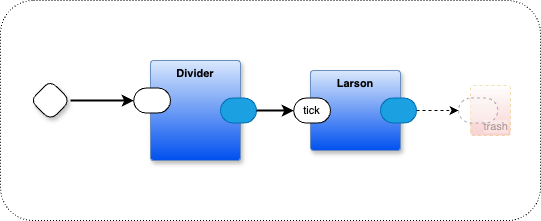
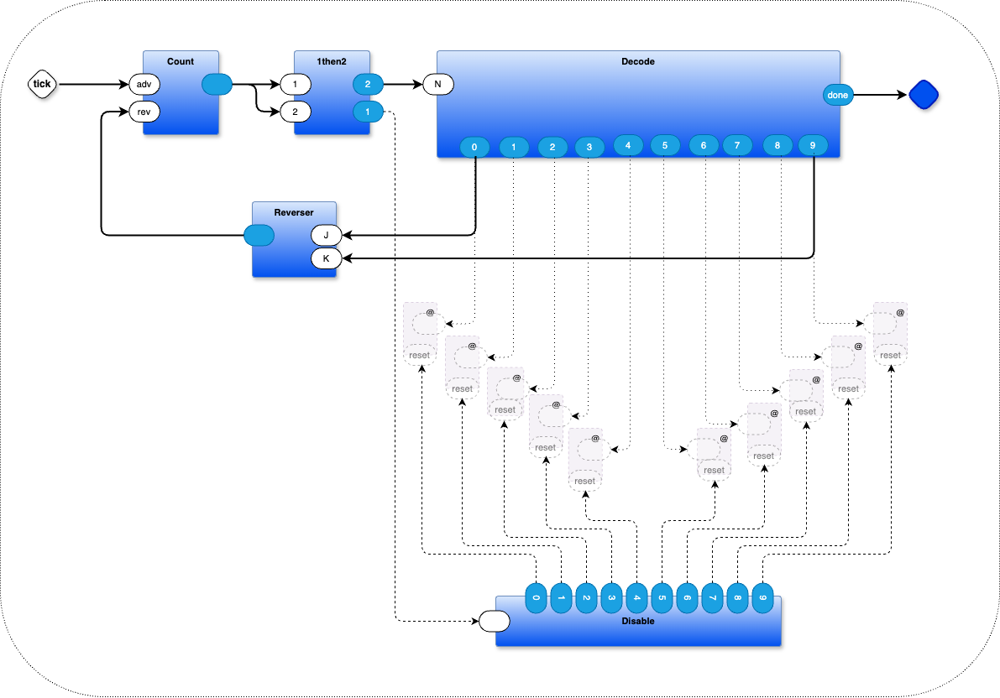

# Larson Scanner Project

This project implements a Larson Scanner in a browser, using source code written as diagrams in draw.io.

The Larson scanner app creates a classic "Knight Rider" style back-and-forth light pattern using a component-based message-passing architecture. See doc/larson.md for how all the pieces fit together:

The main thrust of this example is to show how to generated a browser app using diagrams as code. To accomplish, the code needs to rely on a coroutining kernel written in Javascript.

All of the code, except for the (minimal) HTML file `leds.html` is generated from diagrams and/or from textual code written in a Very High Level language `.rt`. The code generator is include in this project.

# Documentation
see doc/START-HERE.md

# Browser App

# Code Generation
Most of the textual code is written in `.rt` files. 

RT (Recursive text) is a VHLL that compiles to several target languages at once (Javascript, Python, Common Lisp). This project uses only the Javascript code generator.

# usage
- open larson-separate-json.drawio (in draw.io)
- open a terminal window, run `make` (or `make separate` or `make embedded`, default is `make separate`)
- open a browser and open file dplwb.html (it should connect to the websocket generated in the terminal window
- click on drawio diagram, hit SAVE (command-S or control-S (Mac vs. Linux))
- watch compiler generate messages in the browser window
- when "Info" says "...end",
  - copy generated Python code to ./py/workers.py
  - copy generated Javascript code to ./js/workers.js
  - copy generated Common Lisp code to ./cl/workers.lisp
- cd to version of choice, either py/ or js/ or cl/, run make

# 2 versions or the transpiler:
1. transpile larson-separate-json.drawio to larson.drawio.json, generate code that reads the file
   - run the result with node.js
2. transpile larson-embed-json.drawio into JSON, then embed the JSON as a constant in the generated file
   - run the result in a browser
	
There are minor differences in the way that the pipelines are generated - see the corresponding diagrams.

## utilities

$ ./zd/lu.py "message"
	- makes "message" appear in "Info" text area of dplwb.html as long as choreographer.py is running
	
