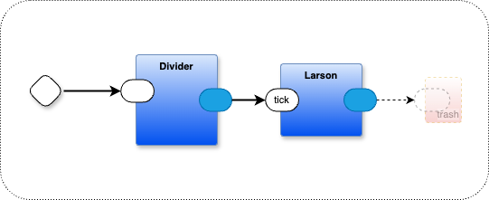

# Summary of scanner.drawio

1. **Main Container**
   - Contains three components: Larson, Divider, and trash
   - The flow starts with a message sent to the Divider
   - Divider sends messages to Larson on the "tick" port
   - Larson's output is routed to the trash component
	 - the output from Larson is due to historical bootstrapping considerations and is no longer needed, sending it to trash prevents runtime error messages (I could just delete the output and make corresponding changes in Larson, but, momentum has kept this design the way it is. Later.).

2. **Larson Container (Choreographer)**
   - Named after the "Larson Scanner" (like the sweeping light bar in Knight Rider)
   - Implements a visual scanning pattern using several components:
     - Count: Tracks position and direction
     - Reverser: Flips the counting direction at endpoints
     - Decode: Translates count values to specific outputs (0-9)
     - Multiple Monitor (@) components: Display the visual pattern (10 instances)
     - 1then2: Sequences messages to ensure proper ordering
     - Disable: Resets monitors to clear previous state
   
   - The connection flow creates a back-and-forth scanning pattern:
     1. Divider triggers Count at intervals
     2. Count increments a position value
     3. 1then2 ensures sequencing
     4. Decode routes to appropriate Monitor components
     5. When reaching 0 or 9, Reverser changes the count direction
     6. Reset signals clear previous positions

The drawing `scanner.drawio` is converted to JSON by the code generator. It defines a (layered) circuit diagram for a Larson Scanner effect where a light pattern moves back and forth across a row of indicators, creating the familiar "sweeping" visual effect.
